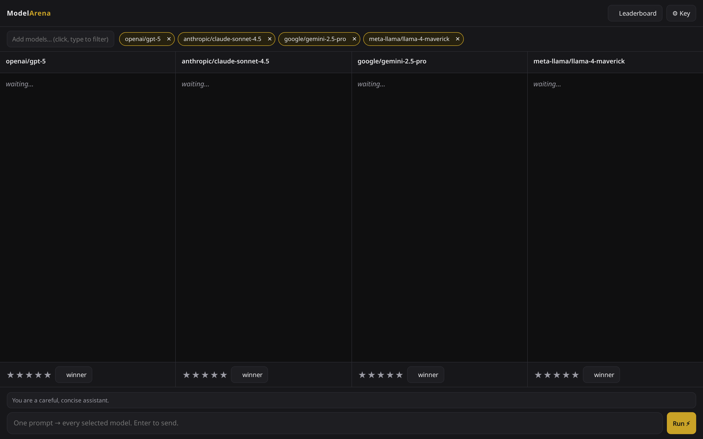

# ModelArena

**One prompt, up to four models, side by side — with real cost, latency, and your own quality scores on a persistent leaderboard.**

A single-file PWA for comparing LLMs through [OpenRouter](https://openrouter.ai). No build step, no dependencies, no backend. Download `index.html` and open it, or use the hosted version.

## Why it exists

Benchmark averages don't tell you which model is best *for your prompts*, and pricing pages don't tell you what a model actually costs *per answer*. ModelArena answers both from your own usage: send the prompts you care about, watch the models stream in parallel, score the responses, and let the leaderboard accumulate quality-vs-cost evidence over time.

## Features

- **2–4 lanes, one prompt.** Pick models from the live OpenRouter catalog — the picker shows each model's actual $/Mtok pricing before you add it. An optional shared system prompt applies to every lane.
- **Parallel streaming.** All lanes stream simultaneously (SSE), so you watch relative speed as well as read the output.
- **Real cost per answer.** Computed from the API's actual token counts × OpenRouter's per-token pricing — not estimates from averages. (If a response omits usage data, an `est` pill marks the fallback.)
- **Latency and TTFT** per lane, per round.
- **Your judgment, persisted.** Rate each response 1–5 stars, mark a winner per round, and the leaderboard accumulates rounds, wins, average stars, total spend, tokens out, average seconds, and $/round per model — all in `localStorage`.
- **Installable PWA.** Inline manifest + service worker; add to home screen and it runs as a standalone app with an offline shell.

## Quick start

1. Open the app (hosted link above, or just open `index.html` in any modern browser — works from `file://`).
2. Click **⚙ Key** and paste a key from [openrouter.ai/keys](https://openrouter.ai/keys). Costs bill to your own OpenRouter account at each model's listed price.
3. Click **Add models…** and pick 2–4 contenders.
4. Type a prompt, hit Enter. Watch the lanes stream, then star the responses and crown a winner.
5. Repeat with the prompts you actually use. The **🏆 Leaderboard** tells you which model earns its cost.

## Privacy

Your API key, selections, and every statistic live only in your browser's `localStorage`. The app talks to exactly one host — `openrouter.ai` — directly from your browser. There is no analytics, no server, no third party.

## Tech notes

One HTML file, ~400 lines including styles. Zero npm, zero frameworks. Streaming via `fetch` + `ReadableStream` against OpenRouter's chat completions endpoint with `usage: {include: true}`; PWA manifest and service worker are generated at runtime from blobs, so the file stays self-contained.

## Roadmap

- **Blind judging** — anonymous lanes (A/B/C/D) with identities revealed after scoring, plus Elo-style ratings
- **CSV export** of rounds and leaderboard stats

## License

MIT
